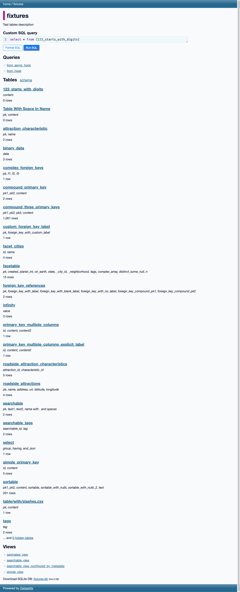

# Accessibility Audit of Datasette Fixtures

*2026-02-10T13:37:15Z*

Accessibility audit of https://latest.datasette.io/fixtures using rodney for Chrome automation.

```bash
go run . start
```

```output
Chrome started (PID 21841)
Debug URL: ws://127.0.0.1:53905/devtools/browser/0ff08c3c-991f-44a1-86d1-148fa030ad4e
```

```bash
go run . open https://latest.datasette.io/fixtures
```

```output
fixtures
```

## Page Title and URL

```bash
go run . title
```

```output
fixtures
```

```bash
go run . url
```

```output
https://latest.datasette.io/fixtures
```

## Take a screenshot

```bash {image}
go run . screenshot audit-screenshot.png
```



## Full Accessibility Tree

```bash
go run . ax-tree --depth 10
```

```output
[RootWebArea] "fixtures" (focusable)
  [generic]
    [banner]
      [navigation]
        [paragraph]
          [link] "home" (focusable)
            [StaticText] "home"
              [InlineTextBox]
          [StaticText] " / "
            [InlineTextBox]
          [link] "fixtures" (focusable)
            [StaticText] "fixtures"
              [InlineTextBox]
    [generic]
      [heading] "fixtures" (level=1)
        [StaticText] "fixtures"
          [InlineTextBox]
      [generic]
        [StaticText] "Test tables description"
          [InlineTextBox]
      [generic]
        [heading] "Custom SQL query" (level=3)
          [StaticText] "Custom SQL query"
            [InlineTextBox]
        [generic]
          [generic] (live=polite, relevant=additions text)
          [generic] (focusable)
            [textbox] (focusable, settable, autocomplete=list, multiline)
              [generic]
                [StaticText] "select"
                  [InlineTextBox]
                [StaticText] " * "
                  [InlineTextBox]
                [StaticText] "from"
                  [InlineTextBox]
                [StaticText] " ["
                  [InlineTextBox]
                [StaticText] "123"
                  [InlineTextBox]
                [StaticText] "_starts_with_digits]"
                  [InlineTextBox]
        [paragraph]
          [button] "Format SQL" (focusable)
            [StaticText] "Format SQL"
              [InlineTextBox]
          [button] "Run SQL" (focusable)
            [StaticText] "Run SQL"
              [InlineTextBox]
      [heading] "Queries" (level=2)
        [StaticText] "Queries"
          [InlineTextBox]
      [list]
        [listitem] (level=1)
          [ListMarker] "◦ "
          [link] "from_async_hook" (focusable)
            [StaticText] "from_async_hook"
              [InlineTextBox]
        [listitem] (level=1)
          [ListMarker] "◦ "
          [link] "from_hook" (focusable)
            [StaticText] "from_hook"
              [InlineTextBox]
      [heading] "Tables schema" (level=2)
        [StaticText] "Tables "
          [InlineTextBox]
        [link] "schema" (focusable)
          [StaticText] "schema"
            [InlineTextBox]
      [heading] "123_starts_with_digits" (level=3)
        [link] "123_starts_with_digits" (focusable)
          [StaticText] "123_starts_with_digits"
            [InlineTextBox]
      [paragraph]
        [emphasis]
          [StaticText] "content"
            [InlineTextBox]
      [paragraph]
        [StaticText] "0 rows"
          [InlineTextBox]
      [heading] "Table With Space In Name" (level=3)
        [link] "Table With Space In Name" (focusable)
          [StaticText] "Table With Space In Name"
            [InlineTextBox]
      [paragraph]
        [emphasis]
          [StaticText] "pk, content"
            [InlineTextBox]
      [paragraph]
        [StaticText] "0 rows"
          [InlineTextBox]
      [heading] "attraction_characteristic" (level=3)
        [link] "attraction_characteristic" (focusable)
          [StaticText] "attraction_characteristic"
            [InlineTextBox]
      [paragraph]
        [emphasis]
          [StaticText] "pk, name"
            [InlineTextBox]
      [paragraph]
        [StaticText] "2 rows"
          [InlineTextBox]
      [heading] "binary_data" (level=3)
        [link] "binary_data" (focusable)
          [StaticText] "binary_data"
            [InlineTextBox]
      [paragraph]
        [emphasis]
          [StaticText] "data"
            [InlineTextBox]
      [paragraph]
        [StaticText] "3 rows"
          [InlineTextBox]
      [heading] "complex_foreign_keys" (level=3)
        [link] "complex_foreign_keys" (focusable)
          [StaticText] "complex_foreign_keys"
            [InlineTextBox]
      [paragraph]
        [emphasis]
          [StaticText] "pk, f1, f2, f3"
            [InlineTextBox]
      [paragraph]
        [StaticText] "1 row"
          [InlineTextBox]
      [heading] "compound_primary_key" (level=3)
        [link] "compound_primary_key" (focusable)
          [StaticText] "compound_primary_key"
            [InlineTextBox]
      [paragraph]
        [emphasis]
          [StaticText] "pk1, pk2, content"
            [InlineTextBox]
      [paragraph]
        [StaticText] "2 rows"
          [InlineTextBox]
      [heading] "compound_three_primary_keys" (level=3)
        [link] "compound_three_primary_keys" (focusable)
          [StaticText] "compound_three_primary_keys"
            [InlineTextBox]
      [paragraph]
        [emphasis]
          [StaticText] "pk1, pk2, pk3, content"
            [InlineTextBox]
      [paragraph]
        [StaticText] "1,001 rows"
          [InlineTextBox]
      [heading] "custom_foreign_key_label" (level=3)
        [link] "custom_foreign_key_label" (focusable)
          [StaticText] "custom_foreign_key_label"
            [InlineTextBox]
      [paragraph]
        [emphasis]
          [StaticText] "pk, foreign_key_with_custom_label"
            [InlineTextBox]
      [paragraph]
        [StaticText] "1 row"
          [InlineTextBox]
      [heading] "facet_cities" (level=3)
        [link] "facet_cities" (focusable)
          [StaticText] "facet_cities"
            [InlineTextBox]
      [paragraph]
        [emphasis]
          [StaticText] "id, name"
            [InlineTextBox]
      [paragraph]
        [StaticText] "4 rows"
          [InlineTextBox]
      [heading] "facetable" (level=3)
        [link] "facetable" (focusable)
          [StaticText] "facetable"
            [InlineTextBox]
      [paragraph]
        [emphasis]
          [StaticText] "pk, created, planet_int, on_earth, state, _city_id, _neighborhood, tags, complex_array, distinct_some_null, n"
            [InlineTextBox]
      [paragraph]
        [StaticText] "15 rows"
          [InlineTextBox]
      [heading] "foreign_key_references" (level=3)
        [link] "foreign_key_references" (focusable)
          [StaticText] "foreign_key_references"
            [InlineTextBox]
      [paragraph]
        [emphasis]
          [StaticText] "pk, foreign_key_with_label, foreign_key_with_blank_label, foreign_key_with_no_label, foreign_key_compound_pk1, foreign_key_compound_pk2"
            [InlineTextBox]
      [paragraph]
        [StaticText] "2 rows"
          [InlineTextBox]
      [heading] "infinity" (level=3)
        [link] "infinity" (focusable)
          [StaticText] "infinity"
            [InlineTextBox]
      [paragraph]
        [emphasis]
          [StaticText] "value"
            [InlineTextBox]
      [paragraph]
        [StaticText] "3 rows"
          [InlineTextBox]
      [heading] "primary_key_multiple_columns" (level=3)
        [link] "primary_key_multiple_columns" (focusable)
          [StaticText] "primary_key_multiple_columns"
            [InlineTextBox]
      [paragraph]
        [emphasis]
          [StaticText] "id, content, content2"
            [InlineTextBox]
      [paragraph]
        [StaticText] "1 row"
          [InlineTextBox]
      [heading] "primary_key_multiple_columns_explicit_label" (level=3)
        [link] "primary_key_multiple_columns_explicit_label" (focusable)
          [StaticText] "primary_key_multiple_columns_explicit_label"
            [InlineTextBox]
      [paragraph]
        [emphasis]
          [StaticText] "id, content, content2"
            [InlineTextBox]
      [paragraph]
        [StaticText] "1 row"
          [InlineTextBox]
      [heading] "roadside_attraction_characteristics" (level=3)
        [link] "roadside_attraction_characteristics" (focusable)
          [StaticText] "roadside_attraction_characteristics"
            [InlineTextBox]
      [paragraph]
        [emphasis]
          [StaticText] "attraction_id, characteristic_id"
            [InlineTextBox]
      [paragraph]
        [StaticText] "5 rows"
          [InlineTextBox]
      [heading] "roadside_attractions" (level=3)
        [link] "roadside_attractions" (focusable)
          [StaticText] "roadside_attractions"
            [InlineTextBox]
      [paragraph]
        [emphasis]
          [StaticText] "pk, name, address, url, latitude, longitude"
            [InlineTextBox]
      [paragraph]
        [StaticText] "4 rows"
          [InlineTextBox]
      [heading] "searchable" (level=3)
        [link] "searchable" (focusable)
          [StaticText] "searchable"
            [InlineTextBox]
      [paragraph]
        [emphasis]
          [StaticText] "pk, text1, text2, name with . and spaces"
            [InlineTextBox]
      [paragraph]
        [StaticText] "2 rows"
          [InlineTextBox]
      [heading] "searchable_tags" (level=3)
        [link] "searchable_tags" (focusable)
          [StaticText] "searchable_tags"
            [InlineTextBox]
      [paragraph]
        [emphasis]
          [StaticText] "searchable_id, tag"
            [InlineTextBox]
      [paragraph]
        [StaticText] "2 rows"
          [InlineTextBox]
      [heading] "select" (level=3)
        [link] "select" (focusable)
          [StaticText] "select"
            [InlineTextBox]
      [paragraph]
        [emphasis]
          [StaticText] "group, having, and, json"
            [InlineTextBox]
      [paragraph]
        [StaticText] "1 row"
          [InlineTextBox]
      [heading] "simple_primary_key" (level=3)
        [link] "simple_primary_key" (focusable)
          [StaticText] "simple_primary_key"
            [InlineTextBox]
      [paragraph]
        [emphasis]
          [StaticText] "id, content"
            [InlineTextBox]
      [paragraph]
        [StaticText] "5 rows"
          [InlineTextBox]
      [heading] "sortable" (level=3)
        [link] "sortable" (focusable)
          [StaticText] "sortable"
            [InlineTextBox]
      [paragraph]
        [emphasis]
          [StaticText] "pk1, pk2, content, sortable, sortable_with_nulls, sortable_with_nulls_2, text"
            [InlineTextBox]
      [paragraph]
        [StaticText] "201 rows"
          [InlineTextBox]
      [heading] "table/with/slashes.csv" (level=3)
        [link] "table/with/slashes.csv" (focusable)
          [StaticText] "table/with/slashes.csv"
            [InlineTextBox]
      [paragraph]
        [emphasis]
          [StaticText] "pk, content"
            [InlineTextBox]
      [paragraph]
        [StaticText] "1 row"
          [InlineTextBox]
      [heading] "tags" (level=3)
        [link] "tags" (focusable)
          [StaticText] "tags"
            [InlineTextBox]
      [paragraph]
        [emphasis]
          [StaticText] "tag"
            [InlineTextBox]
      [paragraph]
        [StaticText] "2 rows"
          [InlineTextBox]
      [paragraph]
        [StaticText] "... and "
          [InlineTextBox]
        [link] "6 hidden tables" (focusable)
          [StaticText] "6 hidden tables"
            [InlineTextBox]
      [heading] "Views" (level=2)
        [StaticText] "Views"
          [InlineTextBox]
      [list]
        [listitem] (level=1)
          [ListMarker] "◦ "
          [link] "paginated_view" (focusable)
            [StaticText] "paginated_view"
              [InlineTextBox]
        [listitem] (level=1)
          [ListMarker] "◦ "
          [link] "searchable_view" (focusable)
            [StaticText] "searchable_view"
              [InlineTextBox]
        [listitem] (level=1)
          [ListMarker] "◦ "
          [link] "searchable_view_configured_by_metadata" (focusable)
            [StaticText] "searchable_view_configured_by_metadata"
              [InlineTextBox]
        [listitem] (level=1)
          [ListMarker] "◦ "
          [link] "simple_view" (focusable)
            [StaticText] "simple_view"
              [InlineTextBox]
      [paragraph]
        [StaticText] "Download SQLite DB: "
          [InlineTextBox]
        [link] "fixtures.db" (focusable)
          [StaticText] "fixtures.db"
            [InlineTextBox]
        [StaticText] " "
          [InlineTextBox]
        [emphasis]
          [StaticText] "244.0 KB"
            [InlineTextBox]
    [contentinfo]
      [StaticText] "Powered by "
        [InlineTextBox]
      [link] "Datasette" (focusable)
        [StaticText] "Datasette"
          [InlineTextBox]
```

## Audit Findings

Now we check for specific accessibility concerns.

### 1. Document Language Attribute

Check if the page has a lang attribute on the html element.

```bash
go run . js "document.documentElement.lang"
```

```output
en
```

**PASS**: The page has `lang="en"` on the html element.

### 2. Heading Hierarchy

Check that heading levels are used in a logical, non-skipping order.

```bash
go run . js "Array.from(document.querySelectorAll(\"h1,h2,h3,h4,h5,h6\")).map(h => h.tagName + \": \" + h.textContent.trim()).join(\"\\n\")"
```

```output
H1: fixtures
H3: Custom SQL query
H2: Queries
H2: Tables schema
H3: 123_starts_with_digits
H3: Table With Space In Name
H3: attraction_characteristic
H3: binary_data
H3: complex_foreign_keys
H3: compound_primary_key
H3: compound_three_primary_keys
H3: custom_foreign_key_label
H3: facet_cities
H3: facetable
H3: foreign_key_references
H3: infinity
H3: primary_key_multiple_columns
H3: primary_key_multiple_columns_explicit_label
H3: roadside_attraction_characteristics
H3: roadside_attractions
H3: searchable
H3: searchable_tags
H3: select
H3: simple_primary_key
H3: sortable
H3: table/with/slashes.csv
H3: tags
H2: Views
```

**ISSUE**: The heading hierarchy skips from H1 directly to H3 for "Custom SQL query". The H3 appears before any H2, which breaks the logical heading order. Screen reader users navigating by headings will encounter an unexpected jump. The "Custom SQL query" heading should be an H2, or a preceding H2 section heading should be added.

### 3. Landmark Regions

Check for proper use of ARIA landmarks and HTML5 sectioning elements.

```bash
go run . js "document.querySelector(\"main\")"
```

```output
null
```

**ISSUE**: The page has `header`, `nav`, and `footer` landmark elements (banner, navigation, contentinfo roles), but there is **no `<main>` element**. The main content area is wrapped in a plain `<div>`. This means screen reader users cannot quickly jump to the primary content using landmark navigation. A `<main>` landmark should wrap the primary page content.

### 4. Navigation Landmark Label

Check if the nav element has an accessible label to distinguish it from other navigation regions.

```bash
go run . js "document.querySelector(\"nav\").getAttribute(\"aria-label\")"
```

```output
null
```

**ISSUE**: The `<nav>` element has no `aria-label` or `aria-labelledby` attribute. While this page only has one nav, best practice is to label navigation landmarks (e.g., `aria-label="Breadcrumb"`) so users understand their purpose.

### 5. Form Accessibility

Check if the SQL query form has proper labels, and whether the textarea is labeled.

```bash
go run . ax-node "textarea"
```

```output
role: generic
```

```bash
go run . ax-node ".cm-editor"
```

```output
role: generic
```

```bash
go run . ax-node "[role=textbox]"
```

```output
role: textbox
value: select * from [123_starts_with_digits]
focusable: true
editable: plaintext
settable: true
autocomplete: list
multiline: true
readonly: false
required: false
```

**ISSUE**: The SQL editor textbox (CodeMirror) has `role="textbox"` and is focusable, but it has **no accessible name** — no `aria-label`, `aria-labelledby`, or associated `<label>`. Screen reader users will hear "textbox" with no indication of its purpose. It should be labeled, e.g., `aria-label="SQL query"`.

### 6. Link Accessibility

Check for any links with empty or unhelpful text.

```bash
go run . js "document.querySelectorAll(\"a\").length"
```

```output
35
```

```bash
go run . js "document.querySelectorAll(\"a:not([aria-label])\").length + \" links without aria-label (normal if text content is present)\""
```

```output
35 links without aria-label (normal if text content is present)
```

```bash
go run . js 'Array.from(document.querySelectorAll("a")).filter(function(a){return a.textContent.trim().length===0}).length'
```

```output
0
```

**PASS**: All 35 links on the page have visible text content. No empty or unlabeled links found.

### 7. Button Accessibility

Check that all buttons have accessible names.

```bash
go run . ax-find --role button
```

```output
[button] "Format SQL" backendNodeId=66 (focusable)
[button] "Run SQL" backendNodeId=7 (focusable)
```

**PASS**: Both buttons ("Format SQL" and "Run SQL") have clear, descriptive accessible names.

### 8. Image Accessibility

Check if any images are present and whether they have alt text.

```bash
go run . js "document.querySelectorAll(\"img\").length + \" images found\""
```

```output
0 images found
```

**PASS**: No images on this page, so no alt text issues.

### 9. Color Contrast

Check if text has sufficient contrast. We inspect the computed styles of key elements.

```bash
go run . js "getComputedStyle(document.body).color + \" on \" + getComputedStyle(document.body).backgroundColor"
```

```output
rgb(17, 26, 53) on rgb(248, 250, 251)
```

```bash
go run . js "getComputedStyle(document.querySelector(\"a\")).color"
```

```output
rgba(255, 255, 244, 0.8)
```

```bash
go run . js "getComputedStyle(document.querySelector(\".table-description a, h3 a\")).color"
```

```output
rgb(39, 104, 144)
```

**PASS**: Body text is dark (`rgb(17, 26, 53)`) on a near-white background (`rgb(248, 250, 251)`) — excellent contrast ratio. Content links are `rgb(39, 104, 144)` (a medium-dark blue) which provides good contrast against the light background. Navigation links use light text on a dark header, which is standard and appropriate.

### 10. Focus Indicators

Check that interactive elements have visible focus styles.

```bash
go run . js "getComputedStyle(document.querySelector(\"button\")).outlineStyle"
```

```output
none
```

```bash
go run . focus "button" && go run . js "getComputedStyle(document.activeElement).outlineStyle + \" \" + getComputedStyle(document.activeElement).outlineColor + \" \" + getComputedStyle(document.activeElement).outlineWidth"
```

```output
Focused
none rgb(0, 123, 255) 0px
```

```bash
go run . js "getComputedStyle(document.activeElement).boxShadow"
```

```output
none
```

**ISSUE**: When a button is focused, it has `outline: none` with no box-shadow substitute. This means **keyboard users may not see which element is currently focused**. The CSS appears to suppress the default focus outline. All interactive elements should have a visible focus indicator (WCAG 2.4.7).

### 11. Skip Navigation Link

Check for a "skip to main content" link for keyboard users.

```bash
go run . js "document.querySelectorAll(\"a[href=\\\"#main\\\"], a[href=\\\"#content\\\"], .skip-link, .skip-nav, [class*=skip]\").length + \" skip links found\""
```

```output
0 skip links found
```

**ISSUE**: No skip navigation link found. Keyboard users must tab through the entire header and navigation before reaching the main content. A "Skip to content" link should be the first focusable element on the page (WCAG 2.4.1).

### 12. Tables Semantic Markup

Check if the table list uses proper semantic structure (though this page uses headings + paragraphs rather than HTML tables).

```bash
go run . js "document.querySelectorAll(\"table\").length + \" HTML tables found\""
```

```output
0 HTML tables found
```

**PASS**: No HTML `<table>` elements are used on this page. The database table listings use headings and paragraphs, which is a reasonable semantic choice for a list of tables with metadata.

### 13. ARIA Live Regions

Check for ARIA live regions and whether they are used appropriately.

```bash
go run . js "document.querySelectorAll(\"[aria-live]\").length + \" live regions\""
```

```output
1 live regions
```

```bash
go run . js "document.querySelector(\"[aria-live]\").getAttribute(\"aria-live\") + \" - \" + document.querySelector(\"[aria-live]\").className"
```

```output
polite - 
```

**PASS**: There is one `aria-live="polite"` region, which is part of the CodeMirror SQL editor. This is appropriate for announcing autocomplete suggestions without interrupting the user.

### 14. Keyboard Tab Order

Test the tab order by counting all focusable elements.

```bash
go run . js "document.querySelectorAll(\"a[href], button, input, select, textarea, [tabindex]\").length + \" focusable elements\""
```

```output
39 focusable elements
```

```bash
go run . js "document.querySelectorAll(\"[tabindex]\").length + \" elements with explicit tabindex\""
```

```output
1 elements with explicit tabindex
```

```bash
go run . js "document.querySelector(\"[tabindex]\").tagName + \" tabindex=\" + document.querySelector(\"[tabindex]\").getAttribute(\"tabindex\")"
```

```output
DIV tabindex=-1
```

**PASS**: 39 focusable elements with only 1 explicit tabindex (`tabindex="-1"` on a div, which is standard for programmatic focus). No positive tabindex values that would disrupt natural tab order.

## Summary

### Issues Found

| # | Issue | WCAG | Severity |
|---|-------|------|----------|
| 1 | Heading hierarchy skips from H1 to H3 ("Custom SQL query") | 1.3.1 Info and Relationships | Minor |
| 2 | No `<main>` landmark element | 1.3.1, 2.4.1 | Moderate |
| 3 | `<nav>` element has no accessible label | Best Practice | Minor |
| 4 | SQL editor textbox has no accessible name | 4.1.2 Name, Role, Value | Moderate |
| 5 | Buttons show no visible focus indicator | 2.4.7 Focus Visible | Moderate |
| 6 | No "skip to content" link | 2.4.1 Bypass Blocks | Moderate |

### Passing Checks

- Document language attribute (`lang="en"`) is set
- All 35 links have visible text content
- Both buttons have clear accessible names
- No images (so no alt text concerns)
- Good color contrast (dark text on light background)
- ARIA live region used appropriately for CodeMirror autocomplete
- No disrupted tab order (no positive tabindex values)
- Semantic HTML used for lists (Queries, Views sections)

### Recommendations

1. **Add a `<main>` element** around the primary content area
2. **Add `aria-label="SQL query"` to the CodeMirror textbox**
3. **Add a "Skip to content" link** as the first focusable element
4. **Fix heading hierarchy**: change "Custom SQL query" from H3 to H2
5. **Add visible focus styles** for buttons and links (`:focus-visible` outline)
6. **Label the `<nav>`** with `aria-label="Breadcrumb"`
