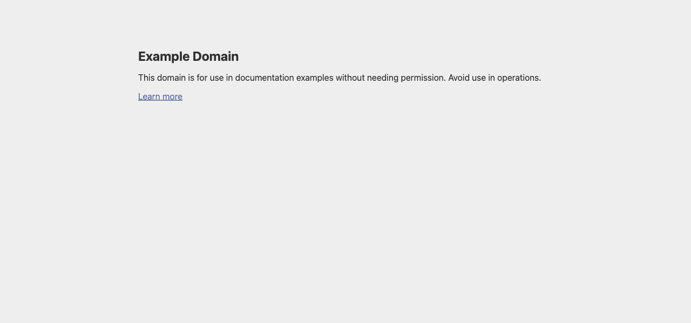
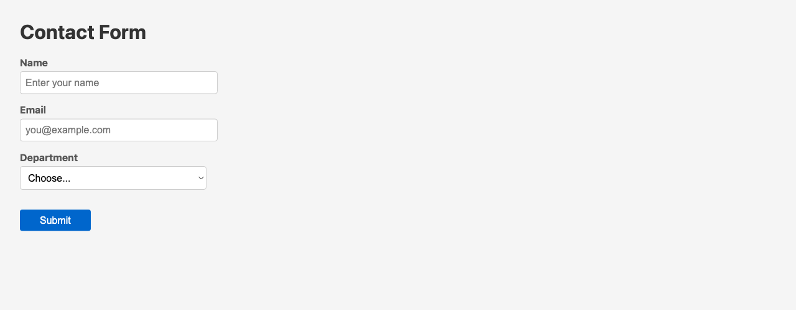
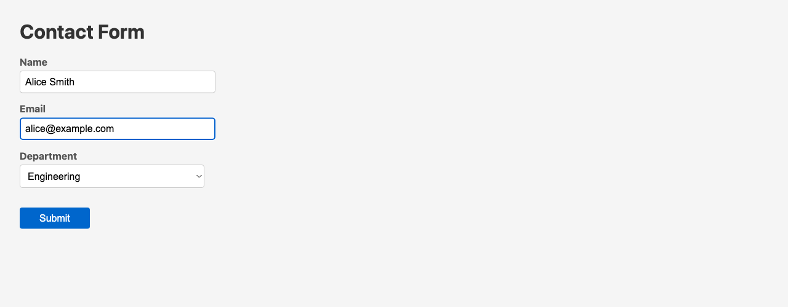

# Rodney: Chrome Automation from the Command Line

*2026-02-09T23:25:45Z*

Rodney is a CLI tool that lets you script Google Chrome from shell commands. It uses a persistent browser architecture: `rodney start` launches a headless Chrome that stays running, and each subsequent command connects to it, performs an action, and disconnects. This makes it ideal for composing multi-step browser workflows in shell scripts.

This document demonstrates every rodney command, with live output and screenshots.

```bash
rodney --version
```

```output
0.1.0
```

## Starting the Browser

Launch a headless Chrome instance with `rodney start`. The browser runs in the background and persists between commands.

```bash
rodney start
```

```output
Chrome started (PID 55032)
Debug URL: ws://127.0.0.1:61354/devtools/browser/f53a62c4-69d5-45bd-80ea-9840d791c06f
```

Check the browser status:

```bash
rodney status
```

```output
Browser running (PID 55032)
Debug URL: ws://127.0.0.1:61354/devtools/browser/f53a62c4-69d5-45bd-80ea-9840d791c06f
Pages: 0
Active page: 0
```

## Navigation

Open a URL in the browser:

```bash
rodney open https://example.com
```

```output
Example Domain
```

Get the current URL and page title:

```bash
rodney url
```

```output
https://example.com/
```

```bash
rodney title
```

```output
Example Domain
```

Take a screenshot with a fixed viewport height:

```bash {image}
rodney screenshot -h 600 /tmp/rodney-example.png && echo /tmp/rodney-example.png
```



## Page Info

Extract the HTML of a specific element:

```bash
rodney html h1
```

```output
<h1>Example Domain</h1>
```

Get the text content of elements:

```bash
rodney text h1
```

```output
Example Domain
```

```bash
rodney text p
```

```output
This domain is for use in documentation examples without needing permission. Avoid use in operations.
```

Read an attribute value from an element:

```bash
rodney attr a href
```

```output
https://iana.org/domains/example
```

Get the full page HTML (or pass a selector for just that element):

```bash
rodney html div
```

```output
<div><h1>Example Domain</h1><p>This domain is for use in documentation examples without needing permission. Avoid use in operations.</p><p><a href="https://iana.org/domains/example">Learn more</a></p></div>
```

## JavaScript Execution

Run arbitrary JavaScript expressions and get JSON output:

```bash
rodney js "document.title"
```

```output
Example Domain
```

```bash
rodney js "document.querySelectorAll(\"a\").length"
```

```output
1
```

```bash
rodney js 'Array.from(document.querySelectorAll("p")).map(p => p.textContent)'
```

```output
[
  "This domain is for use in documentation examples without needing permission. Avoid use in operations.",
  "Learn more"
]
```

## Element Queries

Check if elements exist, count them, and test visibility:

```bash
rodney exists h1 && echo "h1 exists"
```

```output
true
h1 exists
```

```bash
rodney exists h99 || echo "h99 does not exist"
```

```output
false
h99 does not exist
```

```bash
rodney count p
```

```output
2
```

```bash
rodney visible h1 && echo "h1 is visible"
```

```output
true
h1 is visible
```

## Form Interaction

Open a page with a form (loaded from a local HTML file):

```bash
rodney open rodney-form-demo.html
```

```output
Contact Form
```

```bash {image}
rodney screenshot -h 500 /tmp/rodney-form-empty.png && echo /tmp/rodney-form-empty.png
```



Type text into input fields with `input`, and select dropdown options with `select`:

```bash
rodney input "#name" "Alice Smith"
```

```output
Typed: Alice Smith
```

```bash
rodney input "#email" "alice@example.com"
```

```output
Typed: alice@example.com
```

```bash
rodney select "#dept" eng
```

```output
Selected: eng
```

```bash {image}
rodney screenshot -h 500 /tmp/rodney-form-filled.png && echo /tmp/rodney-form-filled.png
```



Clear a field and type new text:

```bash
rodney clear "#name"
```

```output
Cleared
```

```bash
rodney input "#name" "Bob Jones"
```

```output
Typed: Bob Jones
```

Hover over and focus on elements:

```bash
rodney hover "button"
```

```output
Hovered
```

```bash
rodney focus "#email"
```

```output
Focused
```

Submit the form with `click` on the button (or use `submit` on the form element):

```bash
rodney click "button"
```

```output
Clicked
```

The form's `onsubmit` handler displayed a result. Read it back:

```bash
rodney text "#result"
```

```output
Submitted: Bob Jones (eng)
```

```bash {image}
rodney screenshot -h 500 /tmp/rodney-form-submitted.png && echo /tmp/rodney-form-submitted.png
```


## Waiting

Wait for various page states. These are useful in scripts to synchronize with page loading:

```bash
rodney wait "#result"
```

```output
Element visible
```

```bash
rodney waitload
```

```output
Page loaded
```

```bash
rodney waitstable
```

```output
DOM stable
```

```bash
rodney waitidle
```

```output
Network idle
```

```bash
rodney sleep 0.5
```

```output
```

## History Navigation

Navigate back and forward through browser history:

```bash
rodney open https://example.com
```

```output
Example Domain
```

```bash
rodney open https://example.org
```

```output
Example Domain
```

```bash
rodney url
```

```output
https://example.org/
```

```bash
rodney back
```

```output
https://example.com/
```

```bash
rodney url
```

```output
https://example.com/
```

```bash
rodney forward
```

```output
https://example.org/
```

```bash
rodney url
```

```output
https://example.org/
```

Reload the current page:

```bash
rodney reload
```

```output
Reloaded
```

## Tab Management

List open tabs, open new ones, switch between them, and close them:

```bash
rodney pages
```

```output
* [0] Example Domain - https://example.org/
```

```bash
rodney newpage https://example.com
```

```output
Opened [0] https://example.com/
```

```bash
rodney pages
```

```output
* [0] Example Domain - https://example.com/
  [1] Example Domain - https://example.org/
```

Switch to the second tab and verify:

```bash
rodney page 1
```

```output
Switched to [1] Example Domain - https://example.org/
```

```bash
rodney url
```

```output
https://example.org/
```

Close a tab:

```bash
rodney closepage 1
```

```output
Closed page 1
```

```bash
rodney pages
```

```output
* [0] Example Domain - https://example.com/
```

## Element Screenshots

Take a screenshot of a specific element rather than the full page:

```bash {image}
rodney screenshot-el h1 /tmp/rodney-el-h1.png && echo /tmp/rodney-el-h1.png
```


## PDF Export

Save the current page as a PDF:

```bash
rodney pdf /tmp/rodney-demo.pdf && ls -lh /tmp/rodney-demo.pdf
```

```output
Saved /tmp/rodney-demo.pdf (35822 bytes)
-rw-r--r--@ 1 simon  wheel    35K Feb  9 15:31 /tmp/rodney-demo.pdf
```

## Internal State

Rodney stores its browser connection details in `~/.rodney/state.json`:

```bash
cat ~/.rodney/state.json
```

```output
{
  "debug_url": "ws://127.0.0.1:61354/devtools/browser/f53a62c4-69d5-45bd-80ea-9840d791c06f",
  "chrome_pid": 55032,
  "active_page": 0,
  "data_dir": "/Users/simon/.rodney/chrome-data"
}```
```

## Stopping the Browser

Shut down Chrome when done:

```bash
rodney stop
```

```output
Chrome stopped
```

```bash
rodney status
```

```output
No active browser session
```
