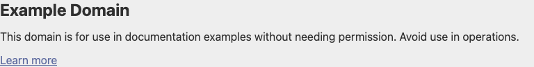

# shot-scraper: A Comprehensive Demo

*2026-02-06T07:35:15Z*

shot-scraper is a command-line tool for taking automated screenshots, scraping HTML, generating PDFs, extracting accessibility trees, and executing JavaScript against web pages. It's built on top of Playwright and supports Chromium, Firefox, and WebKit browsers. This demo walks through every major feature.

## 1. Basic Screenshots

The simplest use: give shot-scraper a URL and it captures the full page. By default the viewport is 1280px wide and the screenshot captures the entire page height.

```bash {image}
uv run shot-scraper https://example.com/ -o demo/basic.png 2>&1 && echo demo/basic.png
```


### Custom Dimensions

Use `-w` (width) and `-h` (height) to control the viewport size. Without `-h`, the screenshot captures the full scrollable page. With both, you get a fixed-size capture.

```bash {image}
uv run shot-scraper https://example.com/ -w 800 -h 400 -o demo/dimensions.png 2>&1 && echo demo/dimensions.png
```


### Retina / HiDPI Screenshots

The `--retina` flag doubles the pixel density (equivalent to `--scale-factor 2`), producing crisp images suitable for high-resolution displays.

```bash {image}
uv run shot-scraper https://example.com/ -w 600 -h 300 --retina -o demo/retina.png 2>&1 && echo demo/retina.png
```


### JPEG Output with Quality Control

Save as JPEG with the `--quality` flag (0-100). This is useful for reducing file size when lossless PNG isn't needed.

```bash
uv run shot-scraper https://example.com/ -w 800 -h 400 -o demo/quality.jpg --quality 40 2>&1
```

```output
Screenshot of 'https://example.com/' written to 'demo/quality.jpg'
```

### CSS Selectors

Use `-s` to capture a specific element by CSS selector. This is great for isolating a particular component — a header, a chart, a card — rather than the full page.

```bash {image}
uv run shot-scraper https://example.com/ -s 'div' -o demo/selector.png 2>&1 && echo demo/selector.png
```



### Selector with Padding

Add `-p` (padding) to include space around the selected element. This prevents the element from being tightly cropped.

```bash {image}
uv run shot-scraper https://example.com/ -s 'h1' -p 20 -o demo/selector-padding.png 2>&1 && echo demo/selector-padding.png
```


### Transparent Background

The `--omit-background` flag removes the default white background, producing a PNG with transparency. Perfect for compositing screenshots into designs.

```bash {image}
uv run shot-scraper https://example.com/ -s 'h1' -p 10 --omit-background -o demo/transparent.png 2>&1 && echo demo/transparent.png
```


## 2. JavaScript Execution

shot-scraper can execute JavaScript on a page before capturing the screenshot. Use `-j` / `--javascript` to manipulate the DOM, hide elements, change styles, or trigger interactions.

```bash {image}
uv run shot-scraper https://example.com/ -w 800 -h 400 --javascript "document.body.style.backgroundColor = 'navy'; document.querySelector('h1').style.color = 'yellow'; document.querySelector('p').style.color = 'white';" -o demo/js-styled.png 2>&1 && echo demo/js-styled.png
```


### JavaScript Scraping

The `shot-scraper javascript` command executes JS and returns results as JSON — no screenshot, just data. This turns any website into a structured data source.

```bash
uv run shot-scraper javascript https://example.com/ "({title: document.title, headings: Array.from(document.querySelectorAll(\"h1\"), el => el.innerText), links: Array.from(document.querySelectorAll(\"a\"), el => ({text: el.innerText, href: el.href}))})"
```

```output
{
    "title": "Example Domain",
    "headings": [
        "Example Domain"
    ],
    "links": [
        {
            "text": "Learn more",
            "href": "https://iana.org/domains/example"
        }
    ]
}
```

### Raw Text Output

The `-r` flag outputs raw text instead of JSON, which is useful for extracting plain strings like the page title.

```bash
uv run shot-scraper javascript https://example.com/ "document.title" -r; printf '\n'
```

```output
Example Domain
```

### Async JavaScript with Promises

shot-scraper supports async operations. You can use `async () => { ... }` or return a Promise. This enables importing remote ES modules, waiting for dynamic content, or performing multi-step scrapes.

```bash
uv run shot-scraper javascript https://example.com/ "
async () => {
  // Simulate async work with a delay
  await new Promise(r => setTimeout(r, 500));
  return {
    title: document.title,
    paragraphs: Array.from(document.querySelectorAll(\"p\"), el => el.innerText)
  };
}
"
```

```output
{
    "title": "Example Domain",
    "paragraphs": [
        "This domain is for use in documentation examples without needing permission. Avoid use in operations.",
        "Learn more"
    ]
}
```

## 3. PDF Generation

`shot-scraper pdf` saves a web page as a PDF, equivalent to the browser's Print → Save as PDF. Supports paper size, orientation, scale, and background graphics.

```bash
uv run shot-scraper pdf https://example.com/ -o demo/example.pdf 2>&1 && file demo/example.pdf
```

```output
PDF of 'https://example.com/' written to 'demo/example.pdf'
demo/example.pdf: PDF document, version 1.4, 1 pages
```

### PDF with Options

Control the paper format, orientation, and whether to include CSS background graphics with `--print-background`.

```bash
uv run shot-scraper pdf https://example.com/ --landscape --format a4 --print-background -o demo/example-landscape.pdf 2>&1
```

```output
PDF of 'https://example.com/' written to 'demo/example-landscape.pdf'
```

## 4. HTML Extraction

`shot-scraper html` dumps the final rendered HTML after JavaScript execution. This captures the DOM as it actually appears in the browser, not the raw source. You can also target a specific element with `-s`.

```bash
uv run shot-scraper html https://example.com/ -s h1; printf '\n'
```

```output
<h1>Example Domain</h1>
```

### HTML with JavaScript Injection

Execute JavaScript to modify the page, then extract the resulting HTML. This is useful for triggering client-side rendering before capturing.

```bash
uv run shot-scraper html https://example.com/ -s div --javascript "document.querySelector(\"h1\").innerText = \"Modified by shot-scraper\""; printf '\n'
```

```output
<div><h1>Modified by shot-scraper</h1><p>This domain is for use in documentation examples without needing permission. Avoid use in operations.</p><p><a href="https://iana.org/domains/example">Learn more</a></p></div>
```

## 5. Accessibility Tree

`shot-scraper accessibility` dumps the Chromium accessibility tree as JSON. This is invaluable for auditing how assistive technologies perceive a page.

```bash
uv run shot-scraper accessibility https://example.com/ 2>&1 | python3 -m json.tool
```

```output
[
    "heading \"Example Domain\" [level=1]",
    {
        "paragraph": "This domain is for use in documentation examples without needing permission. Avoid use in operations."
    },
    {
        "paragraph": [
            {
                "link \"Learn more\"": [
                    {
                        "/url": "https://iana.org/domains/example"
                    }
                ]
            }
        ]
    }
]
```

## 6. HTTP Archive (HAR) Recording

`shot-scraper har` records all HTTP requests and responses made while loading a page, saved as a HAR file. This is useful for debugging network behavior, analyzing page weight, and auditing third-party requests.

```bash
uv run shot-scraper har https://example.com/ -o demo/example.har 2>&1 && python3 -c "
import json
har = json.load(open(\"demo/example.har\"))
entries = har[\"log\"][\"entries\"]
print(f\"Total requests: {len(entries)}\")
for e in entries[:5]:
    print(f\"  {e[\"request\"][\"method\"]} {e[\"request\"][\"url\"][:80]} -> {e[\"response\"][\"status\"]}\")
"
```

```output
Total requests: 1
  GET https://example.com/ -> 200
```

## 7. Multi-Shot YAML Configuration

`shot-scraper multi` takes a YAML configuration file and executes multiple screenshots in a single browser session. This is far more efficient than separate commands and supports all screenshot options plus powerful extras like running a local server, executing shell commands between shots, and JavaScript selectors.

```bash
cat > demo/shots.yml << 'YAML'
# Full page at narrow width
- output: demo/mobile-view.png
  url: https://example.com/
  width: 375
  height: 667

# Selector targeting with padding
- output: demo/heading-only.png
  url: https://example.com/
  selector: "h1"
  padding: 15

# JavaScript injection to restyle, then capture
- output: demo/dark-mode.png
  url: https://example.com/
  width: 800
  height: 400
  javascript: |
    document.body.style.backgroundColor = "#1a1a2e";
    document.body.style.color = "#eee";
    document.querySelectorAll("a").forEach(a => a.style.color = "#00d2ff");

# Wide desktop view
- output: demo/desktop-wide.png
  url: https://example.com/
  width: 1440
  height: 900
YAML
cat demo/shots.yml
```

```output
# Full page at narrow width
- output: demo/mobile-view.png
  url: https://example.com/
  width: 375
  height: 667

# Selector targeting with padding
- output: demo/heading-only.png
  url: https://example.com/
  selector: "h1"
  padding: 15

# JavaScript injection to restyle, then capture
- output: demo/dark-mode.png
  url: https://example.com/
  width: 800
  height: 400
  javascript: |
    document.body.style.backgroundColor = "#1a1a2e";
    document.body.style.color = "#eee";
    document.querySelectorAll("a").forEach(a => a.style.color = "#00d2ff");

# Wide desktop view
- output: demo/desktop-wide.png
  url: https://example.com/
  width: 1440
  height: 900
```

```bash
uv run shot-scraper multi demo/shots.yml 2>&1
```

```output
Screenshot of 'https://example.com/' written to 'demo/mobile-view.png'
Screenshot of 'h1' on 'https://example.com/' written to 'demo/heading-only.png'
Screenshot of 'https://example.com/' written to 'demo/dark-mode.png'
Screenshot of 'https://example.com/' written to 'demo/desktop-wide.png'
```

Here are the four screenshots produced by the YAML configuration above:

```bash {image}
echo demo/mobile-view.png
```


```bash {image}
echo demo/heading-only.png
```


```bash {image}
echo demo/dark-mode.png
```


```bash {image}
echo demo/desktop-wide.png
```


### Multi with a Local Server

The multi YAML format supports a `server` directive that starts a local process before taking screenshots. Combined with `sh` directives to run shell commands between steps, this enables self-contained demos that generate their own content.

```bash
cat > demo/server-shots.yml << 'YAML'
# Start a local HTTP server
- server: python3 -m http.server 9876

# Create an HTML page with a shell command
- sh: |
    cat > demo/dashboard.html << 'HTML'
    <!DOCTYPE html>
    <html>
    <head><title>Dashboard</title>
    <style>
      body { font-family: system-ui; margin: 0; padding: 20px; background: linear-gradient(135deg, #667eea 0%, #764ba2 100%); color: white; min-height: 100vh; }
      h1 { margin-top: 0; }
      .cards { display: grid; grid-template-columns: repeat(3, 1fr); gap: 16px; }
      .card { background: rgba(255,255,255,0.15); backdrop-filter: blur(10px); border-radius: 12px; padding: 20px; }
      .card h2 { margin: 0 0 8px 0; font-size: 14px; opacity: 0.8; text-transform: uppercase; }
      .card .value { font-size: 36px; font-weight: bold; }
    </style></head>
    <body>
      <h1>Analytics Dashboard</h1>
      <div class="cards">
        <div class="card"><h2>Users</h2><div class="value">12,847</div></div>
        <div class="card"><h2>Revenue</h2><div class="value">$48.2K</div></div>
        <div class="card"><h2>Growth</h2><div class="value">+23%</div></div>
      </div>
    </body></html>
    HTML

# Screenshot the locally-served page
- output: demo/dashboard.png
  url: http://localhost:9876/demo/dashboard.html
  width: 900
  height: 300
YAML
cat demo/server-shots.yml
```

```output
# Start a local HTTP server
- server: python3 -m http.server 9876

# Create an HTML page with a shell command
- sh: |
    cat > demo/dashboard.html << 'HTML'
    <!DOCTYPE html>
    <html>
    <head><title>Dashboard</title>
    <style>
      body { font-family: system-ui; margin: 0; padding: 20px; background: linear-gradient(135deg, #667eea 0%, #764ba2 100%); color: white; min-height: 100vh; }
      h1 { margin-top: 0; }
      .cards { display: grid; grid-template-columns: repeat(3, 1fr); gap: 16px; }
      .card { background: rgba(255,255,255,0.15); backdrop-filter: blur(10px); border-radius: 12px; padding: 20px; }
      .card h2 { margin: 0 0 8px 0; font-size: 14px; opacity: 0.8; text-transform: uppercase; }
      .card .value { font-size: 36px; font-weight: bold; }
    </style></head>
    <body>
      <h1>Analytics Dashboard</h1>
      <div class="cards">
        <div class="card"><h2>Users</h2><div class="value">12,847</div></div>
        <div class="card"><h2>Revenue</h2><div class="value">$48.2K</div></div>
        <div class="card"><h2>Growth</h2><div class="value">+23%</div></div>
      </div>
    </body></html>
    HTML

# Screenshot the locally-served page
- output: demo/dashboard.png
  url: http://localhost:9876/demo/dashboard.html
  width: 900
  height: 300
```

```bash {image}
uv run shot-scraper multi demo/server-shots.yml 2>&1 && echo demo/dashboard.png
```


## 8. Browser Choice

shot-scraper supports multiple browser engines via Playwright: Chromium (default), Firefox, and WebKit. You can also use Chrome or Chrome Beta if installed. Use `-b` to switch. Each browser must be installed first with `shot-scraper install -b <name>`.

```bash
uv run shot-scraper shot --help 2>&1 | grep -A1 "\-b, \-\-browser"
```

```output
  -b, --browser [chromium|firefox|webkit|chrome|chrome-beta]
                                  Which browser to use
```

## 9. Request Logging

The `--log-requests` flag captures every HTTP request/response as newline-delimited JSON — useful for debugging what a page loads.

```bash
uv run shot-scraper https://example.com/ -w 400 -h 300 -o demo/log-test.png --log-requests demo/requests.json 2>&1 && python3 -c "
import json
with open(\"demo/requests.json\") as f:
    for line in f:
        entry = json.loads(line)
        print(f\"  {entry['method']} {entry['url'][:60]} -> {entry['status']}\")
"
```

```output
Screenshot of 'https://example.com/' written to 'demo/log-test.png'
  GET https://example.com/ -> 200
```

## 10. Local HTML Files

shot-scraper can screenshot local HTML files directly — no server needed. Just pass a file path instead of a URL. This is great for testing static HTML, email templates, or generated reports.

```bash {image}
uv run shot-scraper demo/dashboard.html -w 900 -h 300 -o demo/local-file.png 2>&1 && echo demo/local-file.png
```


## Summary

This demo covered shot-scraper's major features:

1. **Basic screenshots** — full page, custom dimensions, retina
2. **CSS selectors** — target specific elements with padding
3. **Transparent backgrounds** — for compositing
4. **JPEG quality control** — size vs. quality tradeoff
5. **JavaScript injection** — restyle pages before capture
6. **JavaScript scraping** — extract structured data as JSON
7. **Async JavaScript** — promises, imports, multi-step scrapes
8. **PDF generation** — with paper size, orientation, backgrounds
9. **HTML extraction** — rendered DOM with optional JS injection
10. **Accessibility trees** — JSON snapshot of the a11y tree
11. **HAR recording** — full HTTP request/response traces
12. **Multi-shot YAML** — batch screenshots with a config file
13. **Local servers** — spin up a server and screenshot generated content
14. **Browser choice** — Chromium, Firefox, or WebKit
15. **Request logging** — NDJSON of all page requests
16. **Local HTML files** — screenshot files without a server

shot-scraper turns any web page into a data source: pixels, PDFs, HTML, JSON, accessibility trees, or network traces.
